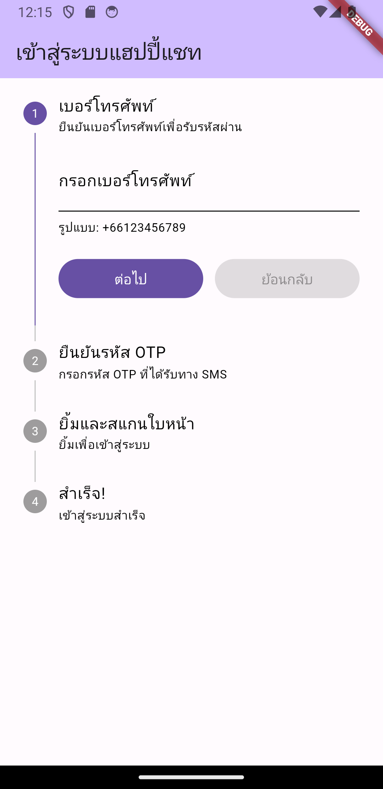

# Happy Chat - Flutter Project

## Project Description

"Happy Chat" is a Flutter-based chat application designed to enhance my Flutter development skills. This project focuses on integrating advanced features like face recognition using Google ML Kit and Firebase services. It's a hands-on approach to learning real-time data handling, Firebase authentication, database management, and innovative user experience design in Flutter.

## Demonstation
- APK : https://github.com/ponjdev/flutter-happy-chat/demo/
- Screenshots:

## Features Checklist

- [✅] **Basic UI Components**
  - [✅] Home Screen
  - [✅] Custom AppBar
  - [✅] Theming

- [✅] **Navigation and Routing**
  - [✅] Bottom Navigation Bar
  - [✅] Page Routing

- [🚧] **State Management**
  - [🚧] Riverpod
  - [🚧] Stateful Widgets

- [🚧] **Forms and Validation**
  - [✅] Form Input
  - [🚧] Form Validation

- [ ] **API Integration and HTTP Requests**
  - [ ] Fetch Data
  - [ ] Post Data

- [✅] **Firebase Integration**
  - [✅] Firebase Auth

- [✅] **Face Recognition (Google ML Kit)**
  - [✅] Smile Verification at Login

- [ ] **Real-time Chat Functionality**
  - [ ] Implement Real-time Messaging
  - [ ] No Chat History Storage

- [🚧] **Push Notifications**
  - [🚧] Firebase Cloud Messaging (FCM)

- [🚧] **Local Storage**
  - [🚧] Secure Storage

- [ ] **Unit and Widget Testing**
  - [ ] Unit Tests
  - [ ] Widget Tests

- [ ] **Additional Features**
  - [ ] Custom Widgets
  - [ ] Responsive Design

## Project Structure
- lib/
    - screens/
    - widgets/
    - services/
    - utils/
    - main.dart

This structure organizes the code into different directories, making it easier to manage and understand.

## Getting Started

1. **Clone the Repository**: `git clone [repository-url]`
2. **Install Dependencies**: Run `flutter pub get` in the project directory.
3. **Run the App**: Execute `flutter run` in your terminal.

